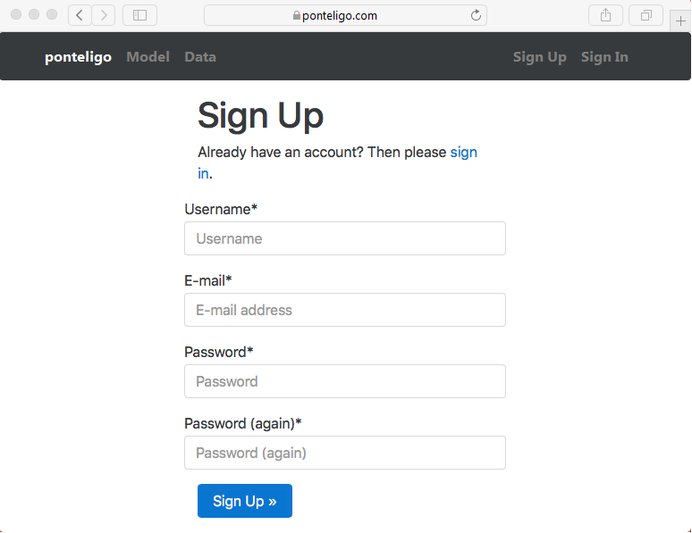

======================
Minimum Viable Product
======================

|

.. comments

:Author(s):
   Francois Roy

:Date Created: 03-14-2017

:Language: Python, Java Script

:Status: :red:`Draft`

-----------

Description
-----------

The proof of concept would be a simple web application with the following components:

- A home page with saved models
- A sign In/Sign Up interface
- A sensor emulator
- A model constructor
- A user view displaying the results of the prediction
- An basic application database (user details, user data, user state-space models, ...)
- An admin interface

The web application will provide a GUI for the engineer to construct a two-state-spaces model, generate a static data stream composed of two uncorelated time series, and lauch the application to observe the results in the user view. Note that there will be no hiden state and learning algorithm procedures in the MVP. The user view will only display the data (predicted, true and real) where the predicted value will be obtained from a simple linear Kalman filter. Only one solver option would be available, i.e. the LU method.

Generation of Data
------------------

The data stream will consist of two "static" signals, i.e. offline mode. The application will generate the two uncorelated time series using some user defined inputs at regular timestep size. These inputs are:

1. Data stream name.
2. Timestep size :math:`\Delta t`.
3. Number of measurements :math:`N`.
4. Sensor labels (one for each signal).
5. The standard deviation of the covariance noise matrix :math:`R_{11}`, and :math:`R_{22}`. The matrix is diagonal for uncorelated signals. We assume that the matrix elements are the variance of the random numbers obtained from a normal distribution of mean 0.

Note that the covariance matrix of the measurement noise :math:`R` is diagonal for uncorelated signals. The data format will consist of a :math:`N`-by-3 matrix where the first column will represent the time, and the second and third the data obtained by the signal emulator.

Construction of the model
-------------------------

The state-transition matrix :math:`A` and the state-to-measurement matrix :math:`H` can be defined by the user. For now only constants  are allowed (including the constant timestep size).

We assume that the covariance noise matrix of the state-transition is diagonal (uncorelated system) and that the diagonal matrix elements, :math:`Q_{11}` and :math:`Q_{22}`, the variances of random number obtained from a normal distribution of mean 0.

We also assume that the initial state space vector is known, i.e. :math:`X_0`.

The user inputs for the model are:

1. The initial state-space vector :math:`X_0`.
2. The four entries of the matrices :math:`A` and :math:`H`.
3. The diagonal components of the matrix :math:`Q`.

Saving the results
------------------

The result and user parameters can be saved in the application database for future use (django model).

API
---

The zolware package will be cloned from the GitHub repository and installed on the server using setuptools. The Python API will provide simple classes for the application.

Localization
------------

The web application must be in French and in English.

Proposed Technology
-------------------

- Coding languages: Python and javascript (user interface)
- Back-end Framework: `Django <https://www.djangoproject.com>`_
- Web Servers: `Nginx <https://nginx.org/en/>`_
- WSGI Server: `Gunicorn <http://gunicorn.org>`_
- Hosting: `Heroku <https://www.heroku.com>`_ hobby account ($7/month)
- Storage: `Amazon S3 <https://aws.amazon.com/s3/>`_
- Templating: `Jinja2 <http://jinja.pocoo.org>`_
- Front-end Framework: `Bootstrap <http://getbootstrap.com>`_
- Email backend: `mailgun <https://www.mailgun.com>`_
- Database: `postgresql <https://www.postgresql.org>`_
- Unit Testing: `pytest <http://doc.pytest.org/en/latest/>`_ and `tox <https://tox.readthedocs.io/en/latest/>`_ 
- Integration testing: `selenium <http://www.seleniumhq.org>`_ + `phantomJS <http://phantomjs.org>`_
- Continuous integration: `Travis CI <https://travis-ci.org>`_
- Code coverage: `codecov <https://codecov.io>`_
- SSL certificate: `DigiCert <https://www.digicert.com>`_ or another competitor.
- Embedded Python figures: `Bokeh <http://bokeh.pydata.org/en/latest/>`_

Future improvments
------------------

- Connection to the data server -- see `Database Service <https://zolware.github.io/specsZolware/database/index.html>`_ for direct data access (streaming or static). 
- Add more information on the sensors: type, location, units...
- Add unknown parameters (parameters to be learned) to the models.
- Add different learning algorithms, for instance the Maximum Likelihood Estimate (MLE).
- Add different smoothing techniques.
- Add other variation of the Kalman filter (Extended, unscent, switching)
- Add other solving methods, e.g. UD filter, Square-root filter.
- Add a bayesian network visualization tool.
- Support for varying time-step size.
- Switch to Amazon EC2?

Site Architecture
-----------------

    
    Schematics of the link between the components (views) of the application.

User Interface
--------------

Here are some basic screenshots

.. figure:: ../images/mvp_signIn.png
    :name: f_signin
    :width: 775px
    :align: center
    :height: 600px
    :alt: alternate text
    :figclass: align-center
    
    The ``Sign In`` page is the default page for the first visit on www.ponteligo.com.

    
    The ``Sign Up`` page uses email validation to register a new user. A basic Mailgun account include 10,000 free emails every month.

Deployment
----------

Follow best practices presented in [Roy2015]_. A good template to begin with is `Cookiecutter <https://github.com/pydanny/cookiecutter-django>`_.

Testing
-------

Compare with the estimation velocity from position example presented in [Phil2010]_

References
----------

.. [Roy2015] `Daniel and Audrey Roy, Two Scoops of Django: Best Practices for Django 1.8, third edition. Two scoops press, 2015 <https://www.amazon.com/Two-Scoops-Django-Best-Practices/dp/0981467342>`_

.. [Phil2010] `Phil Kim, Kalman Filter for Beginners with MATLAB Examples. A-JIN Publishing Company, 2010. <https://www.amazon.com/Kalman-Filter-Beginners-MATLAB-Examples/dp/1463648359>`_
