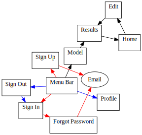
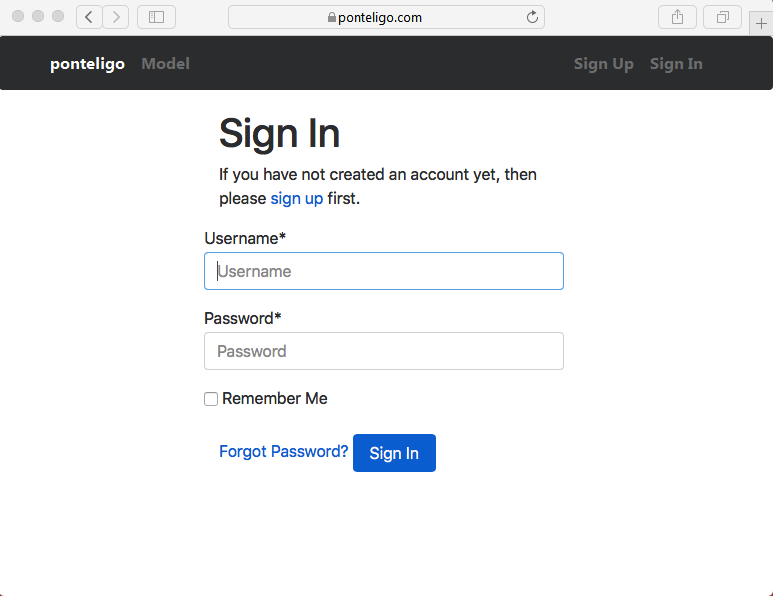
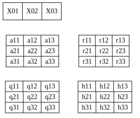

======================
Minimum Viable Product
======================

|

.. comments

:Author(s):
   Francois Roy

:Date Created: 03-14-2017

:Language: None

:Status: :red:`Draft`

-----------

Description
-----------

The proof of concept would be a simple web application with the following components:

- A home page containing a list of saved models (database).
- A sign In/Sign Up interface (before authentication).
- A basic user profile interface.
- A method to stream the measurements from zolware.com.
- An interface to construct the state-space model.
- A page displaying the results (signal and prediction).
- An basic application database on a postgreSQL server to save the models.
- An admin interface.

The web application will provide a GUI for the user (engineer) to construct state-space models by manually entering matrix elements in a dedicated web form. The user will also be able to get the data stream from zolware.com, lauch/stop the application, visualize the results, and save/edit the model if desired. 

Note that there will be no hiden state and learning algorithm procedures in the MVP. The user view will only display the data (predicted, real) where the predicted value will be obtained from a simple linear Kalman filter.

The web application will be constructed using the Django web framework and will include two following applications:

1. A "users" app for authentication.
2. A "kalman_model" app to manipulate and visualize the data.

As a proof of concept, the web application will be hosted on Heroku, a popular Platform as a Service (PaaS) in the Python community. The database server and the static file server will eventually be hosted on different server/Content Delivery Network (CDN) in the future.

Measurement Interface
---------------------

The user will have to create an acount on `zolware.com <https://zolware.com>`_ in order to generate time series (uniform timestep size) that can be used by the web application.

Construction of the state-space model
-------------------------------------

The state-transition matrix :math:`\mathbf{A}`, the state-to-measurement matrix :math:`\mathbf{H}`, the covariance matrix of the state-transition noise :math:`\mathbf{Q}`, and the covariance matrix of the measurement noise :math:`\mathbf{R}` will be defined by the user. For now only constants will be allowed (including the constant timestep obtained from the simulated measurements).

We assume that the covariance matrix of the state-transition noise is diagonal (uncorelated system) and that the matrix elements, :math:`Q_{11}` and :math:`Q_{22}`, are the variances of random number obtained from a normal distribution of mean 0. A similarly assumption is made for the covariance matrix of the measurement noise :math:`R`.

We also assume that the initial state space vector is known, i.e. :math:`X_0`.

The user inputs for the model are:

1. The initial state-space vector :math:`X_0`.
2. The entries of the matrices :math:`\mathbf{A}` and :math:`\mathbf{H}`.
3. The diagonal components of the matrix :math:`\mathbf{Q}`.
4. The diagonal components of the matrix :math:`\mathbf{R}`.

API
---

The `zolware package <https://zolware.github.io/specsZolware/api/index.html>`_ will be cloned from the GitHub repository and installed on the Heroku server using setuptools. The Python API will provide simple classes for manipulating the data and producing the results.

Localization
------------

The web application will be available in French and in English.

Project Directory Structure
---------------------------

The Django project layout will be implemented starting from the `Cookiecutter <https://github.com/pydanny/cookiecutter-django>`_ template.

The "users" app
---------------

The Django project will use `django-allauth <https://github.com/pennersr/django-allauth>`_ for authentication. 

The "kalman_model" app
----------------------

The "kalman_model" app will provide a database for the measurements, matrices and results. The application will also provide forms to enter the database parameters and tools to visualize the data.

Models
######

The *User* model will be imported from the "users" app. The *Kalman_Model* model will contain the basic information listed in :numref:`table1`. Note that the *ArrayField* and the *JSONField* are specific to postgreSQL but are available in the django.contrib.postgres.fields module.

.. csv-table:: The *KalmanModel* model.
   :name: table1
   :header: "Field", "Type", "Details"
   :widths: 10, 5, 15

    "owner", "CharField", "ForeignKey(User, on_delete=CASCADE)"
    "measurements", "CharField", "ManyToManyField(Measurement)"
    "initial_states", "ArrayField(models.IntegerField())", "blank=true"
    "a_matrix", "ArrayField(ArrayField(models.IntegerField()))", "blank=true"
    "h_matrix", "ArrayField(ArrayField(models.IntegerField()))", "blank=true"
    "q_matrix", "ArrayField(ArrayField(models.IntegerField()))", "blank=true"
    "r_matrix", "ArrayField(ArrayField(models.IntegerField()))", "blank=true"
    "filename", "JSONField()", ""

Validators will be defined for the ArrayFileds and JSONField in order to make sure the matrices are invertible and that the JSON file can be generated and overwrited when the measurement is updated. 

A *Simulated_Measurement* model will be needed and constructed from the data streamed by zolware.com. The model attributes are presented in :numref:`table2`.

.. csv-table::  The *Simulated_measurement* model.
    :name: table2
    :header: "Field", "Type", "Details"
    :widths: 10, 5, 15

     "name", "CharField", "unique=true"
     "index", "IntegerField", "unique=true"
     "xname", "CharField", "blank=false"
     "xunit", "CharField", "blank=true"
     "yname", "CharField", "blank=false"
     "yunit", "CharField", "blank=true"
     "pubDate", "DateTimeField", "blank=true"
     "originator", "CharField", "blank=true"
     "filename", "JSONField", ""

.. todo::
   Give a brief description of the models' attributes.

Views
#####

Figure :numref:`f_views` shows a schematics of the interaction between the web pages of the application. From the figure we can see that a minimum of 10 views will need to be created.

    
    Schematics of the link between the views of the application. The red links shows are only available before the user registers and the blue links when the user is registered.

Templates
#########

The base template will be based on the original `Cookiecutter <https://github.com/pydanny/cookiecutter-django>`_ template. Figure :numref:`f_signIn` shows the basic template and the Sign In page, the "home" page for non-authenticated users. 

    
    The Sign In page using the Cookiecutter template.

Forms
#####

The Model Form will contain the elements of figure :numref:`f_form` for a three-states model:

    
    Schematics of the model form.

Each elements can be edited excepted for the non-diagonal elements of the matrix :math:`\mathbf{Q}` and :math:`\mathbf{R}`.

Deployment
----------

For now just use the Heroku `instructions <https://devcenter.heroku.com/articles/deploying-python>`_. Eventually we will follow the best practices presented in :cite:`Roy2015`.

Testing
-------

Should be similar to what is presented in the introductory book of :cite:`Parcival2014`.

.. Future improvments
.. ------------------

.. - Add unknown parameters (parameters to be learned) to the models.
.. - Add different learning algorithms, for instance the Maximum Likelihood Estimate (MLE).
.. - Add different smoothing techniques.
.. - Add other variation of the Kalman filter (Extended, unscent, switching)
.. - Add other solving methods, e.g. UD filter, Square-root filter.
.. - Add a bayesian network visualization tool.
.. - Support for varying time-step size.
.. - Switch to Amazon EC2?

References
----------

.. bibliography:: _static/references.bib

